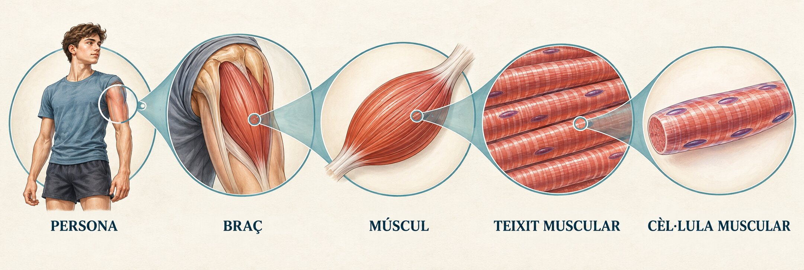

<section class="pv-seccio pv-portada" markdown="1">

UP1 · Activitat 1

# De què està fet el nostre cos?

Del cos humà a la cèl·lula muscular

Biologia i Geologia · 3r ESO PDC

</section>

<section class="pv-seccio" markdown="1">

## Si miràssim el cos cada vegada més de prop…

El teu braç conté **pell, músculs, ossos, vasos sanguinis i nervis**.

Què trobaríem si poguéssim observar-ne una part amb cada vegada més augment?

  <strong>AL QUADERN</strong>
  Escriu una predicció breu abans de veure la imatge.

</section>

<section class="pv-seccio pv-visual" markdown="1">

## Observa el recorregut

  

Cada cercle amplia una part de la imatge anterior.

</section>

<section class="pv-seccio" markdown="1">

1

## De més gran a més petit

Quina és l’estructura més gran de la seqüència?

  <strong>AL QUADERN</strong>
  Escriu-ne el nom i justifica la resposta amb una frase.

</section>

<section class="pv-seccio" markdown="1">

2

## La més petita

Quina és l’estructura més petita de la seqüència?

  <strong>AL QUADERN</strong>
  Escriu-ne el nom.

</section>

<section class="pv-seccio" markdown="1">

3

## A simple vista?

Quines estructures de la seqüència no podem observar a simple vista?

  <strong>AL QUADERN</strong>
  Escriu la resposta i explica quin instrument necessitaríem.

</section>

<section class="pv-seccio" markdown="1">

## Què aprendrem?

En aquesta activitat aprendrem a:

- ordenar els nivells d’organització del cos humà;
- distingir entre **cèl·lula**, **teixit**, **òrgan**, **aparell o sistema** i **organisme**.

<aside class="pv-avís">
El <strong>braç</strong> és una part del cos, però no és un nivell d’organització. Conté diversos òrgans i teixits.
</aside>

</section>

<section class="pv-seccio" markdown="1">

## Els nivells d’organització

Selecciona cada nivell per descobrir-ne la definició.

  <button class="pv-boto-revela" data-pv-revela="def-cellula">CÈL·LULA</button>
  <button class="pv-boto-revela" data-pv-revela="def-teixit">TEIXIT</button>
  <button class="pv-boto-revela" data-pv-revela="def-organ">ÒRGAN</button>
  <button class="pv-boto-revela" data-pv-revela="def-sistema">APARELL O SISTEMA</button>
  <button class="pv-boto-revela" data-pv-revela="def-organisme">ORGANISME</button>

Unitat estructural i funcional bàsica dels éssers vius.

Conjunt de cèl·lules semblants que realitzen una funció determinada.

Estructura formada per diferents teixits que treballen conjuntament.

Conjunt d’òrgans que col·laboren per realitzar una funció.

Ésser viu complet.

</section>

<section class="pv-seccio" markdown="1">

## Una organització en nivells

  CÈL·LULA → TEIXIT → ÒRGAN → APARELL/SISTEMA → ORGANISME

<button class="pv-boto-revela" data-pv-revela="exemple-cor">Mostra’n un exemple</button>

**cèl·lula muscular → teixit muscular → cor → aparell circulatori → persona**

</section>

<section class="pv-seccio" markdown="1">

4

## Reconeix

Ordena aquests nivells de menor a major complexitat.

  òrganorganismecèl·lulaaparell/sistemateixit

  <strong>AL QUADERN</strong>
  Copia els cinc termes en l’ordre correcte i uneix-los amb fletxes.

</section>

<section class="pv-seccio" markdown="1">

5

## Relaciona

Relaciona cada nivell amb la definició corresponent.

  
<strong>Nivells</strong><ol><li>Cèl·lula</li><li>Teixit</li><li>Òrgan</li><li>Aparell o sistema</li><li>Organisme</li></ol>

  
<strong>Definicions</strong><ol type="A"><li>Conjunt d’òrgans que col·laboren.</li><li>Ésser viu complet.</li><li>Unitat bàsica dels éssers vius.</li><li>Conjunt de cèl·lules semblants.</li><li>Estructura formada per diferents teixits.</li></ol>

  <strong>AL QUADERN</strong>
  Escriu les correspondències. Exemple: 1–C.

</section>

<section class="pv-seccio" markdown="1">

6

## Aplica: sistema nerviós

  cèl·lula nerviosa → <strong>?</strong> → cervell → sistema nerviós → organisme

  <strong>AL QUADERN</strong>
  Copia la cadena i completa el nivell que falta.

</section>

<section class="pv-seccio" markdown="1">

7

## Aplica: aparell circulatori

  cèl·lula muscular → teixit muscular → <strong>?</strong> → aparell circulatori → organisme

  <strong>AL QUADERN</strong>
  Copia la cadena i completa el nivell que falta.

</section>

<section class="pv-seccio" markdown="1">

8

## Explica

Per què el cervell és un òrgan i no un teixit?

  <strong>AL QUADERN</strong>
  Respon amb dues frases i utilitza les paraules <em>teixits</em> i <em>funció</em>.

</section>

<section class="pv-seccio pv-tancament" markdown="1">

## Idea clau

  CÈL·LULA → TEIXIT → ÒRGAN → APARELL/SISTEMA → ORGANISME

Cada nivell està format per elements del nivell anterior que treballen conjuntament.

</section>

