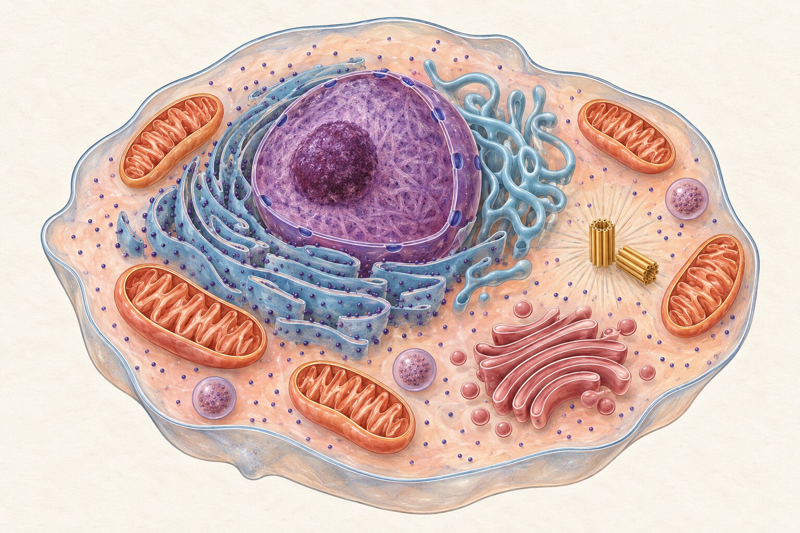
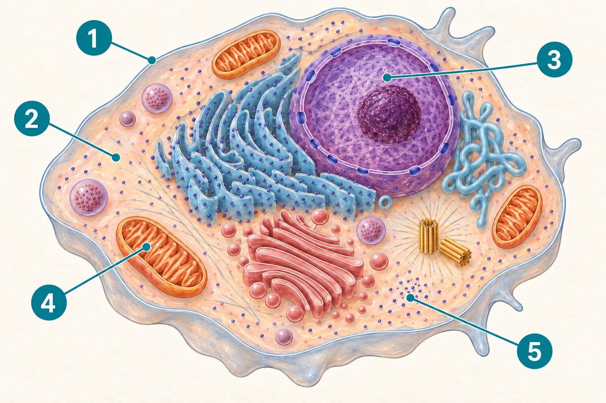

<section class="pv-seccio pv-portada" markdown="1">

UP1 · Activitat 3

# La cèl·lula animal

Descobrim les estructures que permeten que una cèl·lula funcioni

Biologia i Geologia · 3r ESO PDC

</section>

<section class="pv-seccio" markdown="1">

## Una cèl·lula no és una bossa buida

Les cèl·lules del nostre cos són molt petites, però tenen una **organització interna**.

Si totes les parts d’una cèl·lula fessin exactament la mateixa funció, necessitaria estructures diferents al seu interior?

  <strong>AL QUADERN</strong>
  Escriu què en penses i justifica-ho amb una frase.

</section>

<section class="pv-seccio pv-visual" markdown="1">

## Observa una cèl·lula animal

  

És un model: els colors i la disposició dels orgànuls faciliten la interpretació.

</section>

<section class="pv-seccio" markdown="1">

1

## Què hi reconeixes?

Observa el model i identifica tres estructures que reconeguis.

  <strong>AL QUADERN</strong>
  Escriu els tres noms. Si no en recordes algun, descriu-ne la forma o la posició.

</section>

<section class="pv-seccio" markdown="1">

2

## El límit de la cèl·lula

Quina estructura envolta tota la cèl·lula i separa l’interior de l’exterior?

  <strong>AL QUADERN</strong>
  Escriu-ne el nom.

</section>

<section class="pv-seccio" markdown="1">

## Cinc estructures essencials

Selecciona cada estructura per descobrir-ne la funció principal.

  <button class="pv-boto-revela" data-pv-revela="funcio-membrana">MEMBRANA</button>
  <button class="pv-boto-revela" data-pv-revela="funcio-citoplasma">CITOPLASMA</button>
  <button class="pv-boto-revela" data-pv-revela="funcio-nucli">NUCLI</button>
  <button class="pv-boto-revela" data-pv-revela="funcio-mitocondri">MITOCONDRIS</button>
  <button class="pv-boto-revela" data-pv-revela="funcio-ribosomes">RIBOSOMES</button>

<strong>Membrana plasmàtica:</strong> delimita la cèl·lula i regula l’entrada i la sortida de substàncies.

<strong>Citoplasma:</strong> és el medi interior on hi ha els orgànuls i tenen lloc moltes reaccions.

<strong>Nucli:</strong> conté el material genètic i participa en el control de l’activitat cel·lular.

<strong>Mitocondris:</strong> participen en l’obtenció d’energia utilitzable per la cèl·lula.

<strong>Ribosomes:</strong> fabriquen proteïnes.

</section>

<section class="pv-seccio" markdown="1">

## Estructura i funció

  

    <strong>Estructures</strong>
    <ol>
      <li>Membrana plasmàtica</li>
      <li>Nucli</li>
      <li>Mitocondri</li>
      <li>Ribosoma</li>
    </ol>
  

  

    <strong>Funcions</strong>
    <ol type="A">
      <li>Fabrica proteïnes.</li>
      <li>Participa en l’obtenció d’energia.</li>
      <li>Regula l’entrada i la sortida de substàncies.</li>
      <li>Conté el material genètic i participa en el control cel·lular.</li>
    </ol>
  

  <strong>AL QUADERN</strong>
  Relaciona cada nombre amb una lletra. Exemple: 1–C.

</section>

<section class="pv-seccio" markdown="1">

3

## Localitza les funcions

Quina estructura controla l’entrada i la sortida de substàncies? Quina conté el material genètic?

  <strong>AL QUADERN</strong>
  Respon les dues preguntes amb frases completes.

</section>

<section class="pv-seccio" markdown="1">

4

## Energia per continuar viva

Per què una cèl·lula necessita mitocondris?

  <strong>AL QUADERN</strong>
  Explica-ho amb una frase que inclogui les paraules <em>energia</em> i <em>activitat</em>.

</section>

<section class="pv-seccio" markdown="1">

5

## Completa

<ol class="pv-afirmacions">
  <li>Si una cèl·lula necessita fabricar proteïnes, utilitza els __________.</li>
  <li>El __________ és el medi interior on es troben els orgànuls.</li>
  <li>La __________ separa l’interior cel·lular de l’exterior.</li>
</ol>

  <strong>AL QUADERN</strong>
  Copia i completa les tres frases.

</section>

<section class="pv-seccio" markdown="1">

6

## Què passaria si…?

Què podria passar si la membrana plasmàtica no regulàs l’entrada i la sortida de substàncies?

  <strong>AL QUADERN</strong>
  Explica una conseqüència possible en dues o tres frases.

</section>

<section class="pv-seccio pv-visual" markdown="1">

## Un altre model de cèl·lula

  

Les cinc estructures essencials estan assenyalades, però no tenen el nom escrit.

</section>

<section class="pv-seccio" markdown="1">

7

## Identifica les estructures

Quina estructura assenyala cada nombre de la figura?

  <strong>AL QUADERN</strong>
  Escriu els nombres de l’1 al 5 i el nom corresponent al costat.

<button class="pv-boto-revela" data-pv-revela="solucio-numerada">Comprova-ho quan tothom hagi acabat</button>

<strong>1</strong> membrana plasmàtica · <strong>2</strong> citoplasma · <strong>3</strong> nucli · <strong>4</strong> mitocondri · <strong>5</strong> ribosomes

</section>

<section class="pv-seccio" markdown="1">

8

## Compara

En què es diferencia la funció del nucli de la dels mitocondris?

  <strong>AL QUADERN</strong>
  Escriu una frase sobre cada estructura i connecta-les amb <em>en canvi</em>.

</section>

<section class="pv-seccio" markdown="1">

## Altres estructures

A les cèl·lules animals també podem reconèixer:

  reticle endoplasmàticaparell de Golgilisosomescentríols

<aside class="pv-avís">
En aquesta unitat ens centrarem sobretot en les cinc estructures essencials. De les altres, basta que les puguis reconèixer quan apareguin en un model.
</aside>

</section>

<section class="pv-seccio" markdown="1">

9

## Dibuixa el que ara saps

Representa una cèl·lula animal amb les cinc estructures essencials.

  <strong>AL QUADERN</strong>
  Fes un dibuix gran i clar. Assenyala amb fletxes la membrana, el citoplasma, el nucli, els mitocondris i els ribosomes.

No cal copiar els colors ni la posició exacta dels models: has de representar-ne l’organització.

</section>

<section class="pv-seccio" markdown="1">

10

## Abans i ara

Compara el dibuix actual amb el que vas fer a l’Activitat 2.

  <strong>AL QUADERN</strong>
  Escriu tres coses que ara representaries o explicaries de manera diferent.

</section>

<section class="pv-seccio pv-tancament" markdown="1">

## Una pregunta per continuar

Si les cèl·lules són massa petites per observar-les a simple vista, quin instrument podem utilitzar?

  <strong>AL QUADERN</strong>
  Escriu-ne el nom. A l’activitat següent el posarem en pràctica.

</section>

