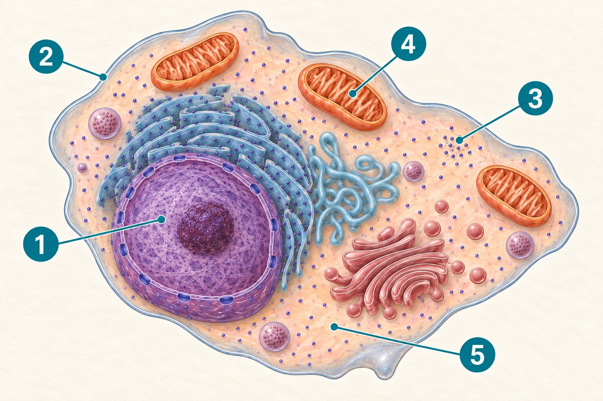

<section class="pv-seccio pv-portada" markdown="1">

UP1 · Activitat 7

# Què he après?

Aplicam el que sabem sobre les cèl·lules i l’organització del cos

Activitat individual · No consultis les activitats anteriors

</section>

<section class="pv-seccio" markdown="1">

1

## De la cèl·lula a l’organisme

Completa aquesta cadena d’organització del cos humà.

  cèl·lula muscular cardíaca → <strong>[1]</strong> → cor → <strong>[2]</strong> → persona

  <strong>AL QUADERN</strong>
  Copia la cadena i substitueix [1] i [2] pels elements que falten.

</section>

<section class="pv-seccio" markdown="1">

## Identifica els nivells

Quin nivell d’organització representa cada element de la cadena anterior?

  <strong>AL QUADERN</strong>
  Escriu els cinc elements i indica al costat si són cèl·lula, teixit, òrgan, aparell o sistema, o organisme.

</section>

<section class="pv-seccio pv-visual" markdown="1">

## Interpreta un model nou

  

Observa la forma, la posició i l’aspecte de les estructures abans de respondre.

</section>

<section class="pv-seccio" markdown="1">

2

## Identifica les estructures

Quina estructura assenyala cada nombre?

  <strong>AL QUADERN</strong>
  Escriu els nombres de l’1 al 5 i el nom de l’estructura corresponent.

</section>

<section class="pv-seccio" markdown="1">

## Justifica dues identificacions

Quina característica del dibuix t’ha ajudat a reconèixer dues de les estructures?

  <strong>AL QUADERN</strong>
  Tria dos nombres. Per a cadascun, escriu el nom de l’estructura i la pista visual que has utilitzat.

</section>

<section class="pv-seccio" markdown="1">

3a

## Fabricar proteïnes

Una cèl·lula necessita fabricar una gran quantitat de proteïnes. Quina estructura hi està més directament relacionada?

  <strong>AL QUADERN</strong>
  Identifica l’estructura i justifica la resposta.

</section>

<section class="pv-seccio" markdown="1">

3b

## Obtenir energia

Una cèl·lula muscular necessita obtenir molta energia per mantenir la seva activitat. Quina estructura hi està més directament relacionada?

  <strong>AL QUADERN</strong>
  Identifica l’estructura i justifica la resposta.

</section>

<section class="pv-seccio" markdown="1">

3c

## Entrar a la cèl·lula

Una substància de l’exterior ha d’entrar a la cèl·lula. Quina estructura hi està més directament relacionada?

  <strong>AL QUADERN</strong>
  Identifica l’estructura i justifica la resposta.

</section>

<section class="pv-seccio" markdown="1">

4

## Unitat estructural i funcional

Per què podem dir que la cèl·lula és la unitat estructural i funcional del nostre cos?

  <strong>AL QUADERN</strong>
  Explica les dues idees en tres o quatre frases: de què està format el cos i què fan les cèl·lules.

</section>

<section class="pv-seccio" markdown="1">

## De la cèl·lula a la nutrició

Una cèl·lula muscular situada a l’interior del cos necessita continuar viva i obtenir energia per funcionar.

<aside class="pv-avís">
Encara no esperam una explicació completa dels aparells implicats. Utilitza el que saps i formula una proposta raonada.
</aside>

</section>

<section class="pv-seccio" markdown="1">

5a

## Què necessita rebre?

Escriu dues coses que aquesta cèl·lula necessita rebre del seu entorn.

  <strong>AL QUADERN</strong>
  Anomena les dues substàncies i explica breument per què poden ser necessàries.

</section>

<section class="pv-seccio" markdown="1">

5b

## Com hi poden arribar?

Com creus que aquestes substàncies poden arribar fins a una cèl·lula situada a l’interior del nostre cos?

  <strong>AL QUADERN</strong>
  Proposa un recorregut o un mecanisme possible i explica’l amb dues o tres frases.

</section>

<section class="pv-seccio" markdown="1">

5c

## Què necessita eliminar?

Proposa una substància que la cèl·lula necessiti eliminar. Com podria allunyar-se de la cèl·lula?

  <strong>AL QUADERN</strong>
  Indica la substància i explica la teva proposta.

</section>

<section class="pv-seccio pv-tancament" markdown="1">

## Una pregunta per continuar

Les cèl·lules necessiten rebre substàncies i eliminar-ne d’altres. Com ho aconsegueix l’organisme sencer?

  <strong>AL QUADERN</strong>
  Escriu una primera hipòtesi. La recuperarem quan estudiem la funció de nutrició.

</section>

